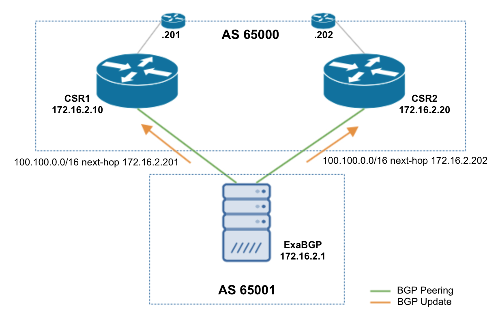
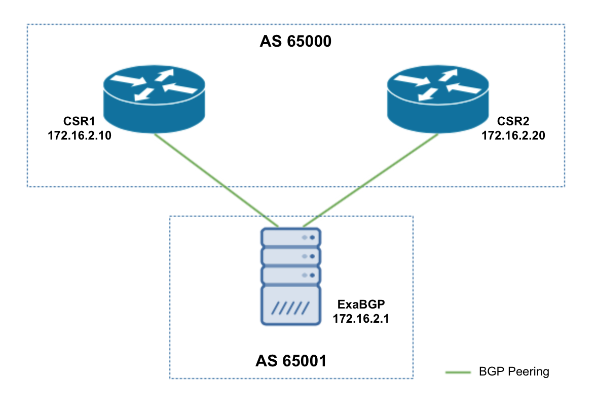

+++
title = "Advanced Route Announcement"
description = "With multiple BGP Peers"
date = 2015-05-24
author = "Mat"
weight = 70

aliases = ["/advanced-router-peering-and-route-announcement/"]
[taxonomies]
tags = ["exabgp", "python"]
+++

Now that you're familiar with the basics of setting up a peer with ExaBGP and advertising routes, let's look at expanding those concepts towards something that might actually be used in production.

<!-- more -->
## Peering with Multiple BGP Routers



Networks running BGP tend to have more than one edge router that you would want to advertise routes to with ExaBGP, so first let's look at how to setup our `conf.ini` file to add peers. What I didn't mention in the previous articles is that the `group { }` object in the config file is similar to a peer-group in Cisco IOS. The difference is that you can only have one group per ExaBGP instance, but this makes sense since the use case seems to be advertising and receiving updates to/from one ASN. We can setup shared values such as router-id, our local AS and update source, and the peer AS. Then we `activate` each neighbor within the group:

```ini
group AS_65000 {
        router-id 172.16.2.1;
        local-as 65001;
        local-address 172.16.2.1;
        peer-as 65000;

        neighbor 172.16.2.10 {
        }

        neighbor 172.16.2.20 {
        }

        process flask-api {
                run /path/to/python /path/to/app.py;
        }
}
```

And here's the basic BGP config on our routers:

```sh
CRS1#sh run | s bgp
router bgp 65000
 neighbor 172.16.2.1 remote-as 65001
 neighbor 172.16.2.1 description ExaBGP
 neighbor 172.16.2.1 soft-reconfiguration inbound
 neighbor 172.16.2.20 remote-as 65000
 neighbor 172.16.2.20 soft-reconfiguration inbound
```

```sh
CSR2#sh run | s bgp
router bgp 65000
 neighbor 172.16.2.1 remote-as 65001
 neighbor 172.16.2.1 description ExaBGP
 neighbor 172.16.2.1 soft-reconfiguration inbound
 neighbor 172.16.2.10 remote-as 65000
 neighbor 172.16.2.10 soft-reconfiguration inbound
```

## Advertising Routes to Multiple Peers

With each router being peered with ExaBGP, you can use the same `announce|withdraw route x.x.x.x/x next-hop y[.y.y.y]` command and the UPDATE message will be sent to all peers. But what if you want to send the same prefix with different next-hops to your routers? Well, this type of advertisement granularity is definitely possible. Let's imagine this scenario where we want to send the 100.100.0.0/16 prefix to both CSR routers, but each router should use a different outbound next-hop.



The commands to do this (possibly using `curl` with the Flask based HTTP API from the previous article) are:

```sh
neighbor 172.16.2.10 announce route 100.100.0.0/16 next-hop 172.16.2.201
neighbor 172.16.2.20 announce route 100.100.0.0/16 next-hop 172.16.2.202
```

And the results on our routers are below. Note that because of the iBGP peering between the routers, both have each other's next hop advertisements in the BGP table. Only the advertised prefix from the ExaBGP is installed in the RIB because of the preference for eBGP learned routes however.

```sh
CRS1#sh bgp | b Network
     Network          Next Hop            Metric LocPrf Weight Path
 * i 100.100.0.0/16   172.16.2.202             0    100      0 65001 i
 *>                   172.16.2.201                           0 65001 i
CRS1#sh ip route bgp | b subnet
      100.0.0.0/16 is subnetted, 1 subnets
B        100.100.0.0 [20/0] via 172.16.2.201, 00:01:40
```

```sh
CSR2#sh bgp | b Network
     Network          Next Hop            Metric LocPrf Weight Path
 *>  100.100.0.0/16   172.16.2.202                           0 65001 i
 * i                  172.16.2.201             0    100      0 65001 i
CSR2#sh ip route bgp | b subnet
      100.0.0.0/16 is subnetted, 1 subnets
B        100.100.0.0 [20/0] via 172.16.2.202, 00:03:15
```

## Advertising Prefixes with Attributes

In all of these examples so far, I've been setting the `next-hop` attribute to either an IP address or the `self` keyword. Using the next-hop self will act as expected and advertise the next-hop as the IP address of the ExaBGP machine. The good news is, we can change other attributes as well! I'm not sure if this is an exhaustive list as it's not well documented (that I can find, maybe this will be my mission) but I dug through the code and test examples to extract the following list and examples of values that we can use:

  * MED (Multi Exit Discriminator): `med 50`
  * Origin: `origin incomplete` (also `egb` or `igp`)
  * Local Preference: `local-preference 200`
  * AS Path: `as-path [ 65000 65010 65020 ]`
  * Community: `community [65000:2]`

Please note local-preference will only work if ExaBGP and the peer you're advertising to are in the same AS (iBGP), since local-preference is non-transitive and will not be advertised outside the ExaBGP AS.

From what I see, you can combine these as you wish. Here's a few example commands I ran into ExaBGP and the output on one of my routers (I used the Flask HTTP API created in the previous article as a simple way to inject these into the ExaBGP process):

```sh
announce route 100.10.0.0/16 next-hop 172.16.2.202 med 500
announce route 100.20.0.0/16 next-hop 172.16.2.202 origin incomplete as-path [100 200 400]
announce route 100.30.0.0/16 next-hop 172.16.2.202 med 200 origin egp
announce route 100.40.0.0/16 next-hop 172.16.2.202 community [65000:2]
```

```sh
CRS1#sh bgp | b Network
     Network          Next Hop            Metric LocPrf Weight Path
 * i 100.10.0.0/16    172.16.2.202           500    100      0 65001 i
 *>                   172.16.2.202           500             0 65001 i
 * i 100.20.0.0/16    172.16.2.202             0    100      0 65001 100 200 400 ?
 *>                   172.16.2.202                           0 65001 100 200 400 ?
 * i 100.30.0.0/16    172.16.2.202           200    100      0 65001 e
 *>                   172.16.2.202           200             0 65001 e
 * i 100.40.0.0/16    172.16.2.202                           0 65001 i
 *>                   172.16.2.202                           0 65001 i
CRS1#
CRS1#sh ip bgp 100.40.0.0
BGP routing table entry for 100.40.0.0/16, version 3
Paths: (2 available, best #2, table Default-IP-Routing-Table)
  Advertised to update-groups:
     1
  65001
    172.16.2.202 from 172.16.2.1 (172.16.2.1)
      Origin IGP, localpref 100, valid, external
      Community: 6553700
  Local
    172.16.2.202 (metric 20) from 172.16.2.20 (2.2.2.2)
      Origin IGP, metric 11, localpref 100, valid, internal, best
```

### Advertising Multiple Prefixes with the same Attributes

There is a shortcut when advertising multiple prefixes that have the same attributes (next-hop, med, origin, etc.). It works very similar to BGP UPDATE messages where you set all the desired attributes, and then list the prefixes that share these attributes. Based on notes from the ExaBGP docs, this is an unsupported feature but I like it and hope that more focus can be brought to make this production ready.

Here's two example commands, note that we can specify a neighbor or send to all neighbors, just like the other examples listed so far:

```sh
announce attribute next-hop self med 50 origin igp nlri 100.10.0.0/16 100.20.0.0/16
neighbor 172.16.2.20 announce attribute next-hop self med 150 origin incomplete nlri 100.30.0.0/16 100.40.0.0/16
```

* * *

That turned out to be a pretty jam-packed with excitement post! There's some helpful flexibility built into ExaBGP and we haven't even gotten to the exciting part. The next couple posts will start to use ExaBGPs JSON interface to receive and work with advertised routes from the peered routers, instead of focusing on pushing advertisements out to your routers.