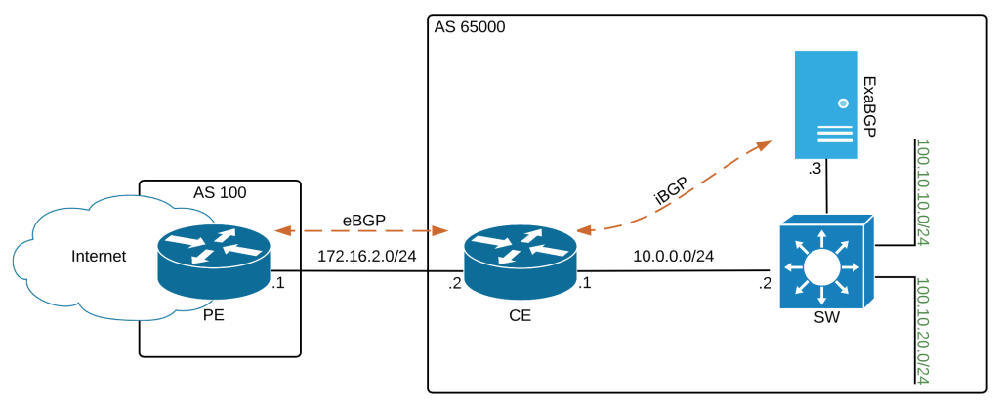

+++
title = "Control BGP Advertisements"
description = "to eBGP peers with ExaBGP"
date = 2015-06-23
author = "Mat"
weight = 60

aliases = ["/control-bgp-advertisements-to-ebgp-peers-with-exabgp/"]
[taxonomies]
tags = ["exabgp", "python"]
+++

We know that ExaBGP can be used to inject BGP routes into an AS that you control. It's a very helpful feature that allows you to automate reachability and traffic flows within your network. But what if you want to you ExaBGP to influence what is advertised, or in this case, not advertised to external peers that are not willing to peer with your ExaBGP service?

<!--more-->


Our scenario is this: We have a 100.10.10.0/24 prefix attached to our SW. The CE router learns about this prefix from SW via OSPF, and then advertises the prefix out to the Internet via the PE router. This 100.10.10.0/24 prefix is anycasted so it is also advertised out of a different location. In order to withdraw the prefix from the PE and therefore the Internet we would need to manually filter the prefix outbound via route-map, or stop the advertisement from the SW which would also remove the resource from local resources.

There has to be a better way, right? You're in luck because I'm going to show you how we can use ExaBGP and BGP communities along with some basic functionality on your existing routers to indirectly influence the advertisement of the 100.10.10.0/24 prefix.

Here's how our BGP peer configuration looks on the CE router:

```sh
CE# show run
router bgp 65000
 network 100.10.10.0 mask 255.255.255.0
 network 100.10.20.0 mask 255.255.255.0
 neighbor 172.16.2.1 remote-as 100
 neighbor 172.16.2.1 route-map OUTBOUND out
 neighbor 10.0.0.3 remote-as 65000
 neighbor 10.0.0.3 weight 32768
!
ip community-list standard EXABGP permit 6553700
!
route-map OUTBOUND deny 10
 match community EXABGP
!
route-map OUTBOUND permit 20
```

Here's the important details:

  * Peering with PE (172.16.2.1) goes through route-map OUTBOUND 
      * This route-mapmatchesthecommunity-listEXABGP to match community 6553700 (or [100:100]) 
          * Any prefix with this community is dropped, all other prefixes are allowed
  * PeeringwithExaBGP (10.0.0.3) 
      * Setting the weight of learned routes from ExaBGP to 32768 ties with the default local sourced weight
      * By matching the Cisco-proprietary weight value, the higher local-preference will win out even on non-Cisco BGP routers
      * This must be an iBGP peering (same AS) so that local-preference passed with the UPDATE from ExaBGP

Here's what the network looks like before the ExaBGP announcement :

```sh
C##sh ip bgp | b Network
   Network          Next Hop            Metric LocPrf Weight Path
*> 100.10.20.0/24   0.0.0.0                  0         32768 i
*> 100.10.10.0/24   10.0.0.2                11         32768 i


PE#sh ip bgp | b Network
   Network          Next Hop            Metric LocPrf Weight Path
*> 100.10.20.0/24   172.16.2.2               0             0 65000 i
*> 100.10.10.0/24   172.16.2.2              11             0 65000 i
```

And here is what it looks like after:

```sh
CE#sh ip bgp | b Network
   Network          Next Hop            Metric LocPrf Weight Path
*> 100.10.20.0/24   0.0.0.0                  0         32768 i
r>i100.10.10.0/24   172.16.2.2                  65000  32768 i
r                   10.0.0.2                11         32768 i
CE#sh ip bgp nei 172.16.2.2 adv | b Network
   Network          Next Hop            Metric LocPrf Weight Path
*> 100.10.20.0/24   0.0.0.0                  0         32768 i

Total number of prefixes 1


PE#sh ip bgp | b Network
   Network          Next Hop            Metric LocPrf Weight Path
*> 100.10.20.0/24   172.16.2.2               0             0 65000 i
```

CE knows about the 100.10.10.0/24 prefix and uses SW as its next-hop. PE is learning the prefix from CE with next-hop of CE due to the eBGP peering.  Notice that the default weight for locally sourced (`network` or `redistribute` commands) prefixes on R1 is 32768. This weight value can range from 0-65535, and on a Cisco device, it is the first value taken into account during the BGP Path Selection algorithm.

When we startup ExaBGP and advertise the prefix 100.10.10.0/24, CE changes the prefix's weight to 65000 and it takes preference over the locally sourced route (`network 100.10.10.0 mask 255.255.255.0`) and is marked as best. Now when CE calculates which prefixes to advertise out to PE, it selects the 100.10.10.0/24 prefix from ExaBGP, which happens to be marked with the [100:100] community. This prefix is then filtered in the outbound advertisements with the OUTBOUND route-map and Viola! The prefix is no longer advertised to PE and the rest of the Internet from this site. The `r` code (RIB failure) on the routes in lines 4 and 5 is happening because the R1 can't prefer the BGP route and install it in the RIB since the OSPF learned prefix has a lower AD. 100.10.10.0/24 is still reachable from R1 and AR so it's not a big deal, read more about it from <a href="http://blog.ipspace.net/2007/12/what-is-bgp-rib-failure.html" target="_blank">ipspace.net</a>.

Here's the ExaBGP conf.ini and python script that allows for this magic to happen:

```python
from sys import stdout, stdin
from time import sleep

# Print the command to STDIN so ExaBGP can execute
stdout.write('announce route 100.10.10.0/24 next-hop 10.0.0.2 local-preference 65000 community [100:100]\n')
stdout.flush()

#Keep the script running so ExaBGP doesn't stop running and tear down the BGP peering
while True:
    sleep(10)</pre>

<pre class="lang:ini decode:true" title="conf.ini">group test {
    router-id 10.0.0.3;
    local-as 65000;
    local-address 10.0.0.3;

    process add_route {
        run /usr/bin/python /etc/exabgp/add_route.py;
    }

    neighbor 10.0.0.1 {
        peer-as 65000;
    }
}
```

Note that this python script clearly isn't the only way to get ExaBGP to advertise this route to R1. The focus of this post is more of how to use the ExaBGP announcements to manipulate your traffic flows by managing prefix advertisements. To see more examples of how to control ExaBGP, check out the earlier posts in this series.