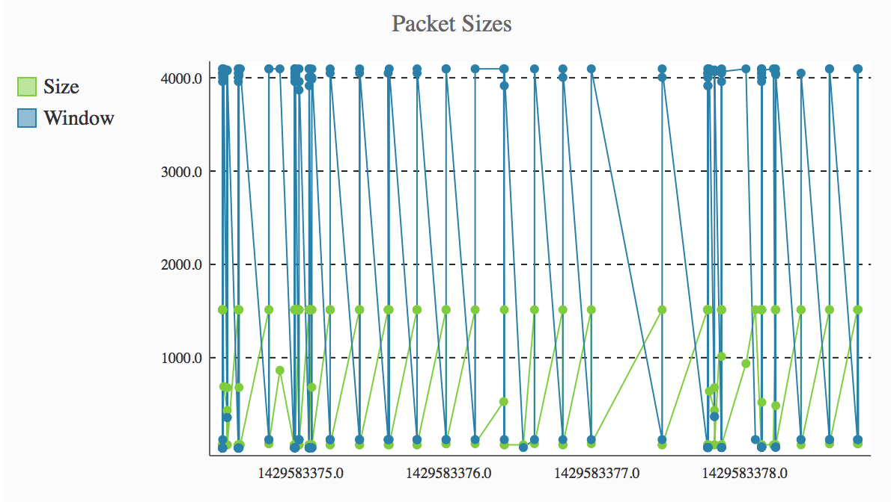

+++
title = "Graphing packet details"
description = "Using PyShark, pygal, and Flask"
date = 2015-04-21
author = "Mat"
weight = 50
draft = true

aliases = ["/graphing-packet-details-with-pyshark-pygal-and-flask/"]
[taxonomies]
tags = ["pyshark", "python"]
+++

So you've used PyShark to get packet statistics out of your trace files but you want to represent them in a more friendly way than just text output? How about using Flask and pygal to get those statistics in a graph or chart for use in a web app!


<!--more-->

This post will be a brief overview of getting some packet data in a chart and on a webpage. Please note that this will be a very simple example and not a recommended production deployment of Flask. I highly recommend using templates, flask-bootstrap, and more advanced Flask topics which you can learn about <a title="Flask" href="http://flask.pocoo.org" target="_blank">here</a>.

First, let's go over some very basic Flask app setup. We're going to setup a single file flask app called `app.py` with our necessary imports and a single route that has a `graph_pcap()` function. This route will return a basic web page with a form for users to upload a pcap file. When the file is uploaded (through an HTTP POST), our `graph_pcap()` function will use PyShark to extract the packet sizes and return a chart to the user's browser.  The comments I've added below outline the logic that we fill in throughout this article. You can see the modules we will use in this project in the imports section at the top. In order to run this example, use pip in your environment (or virtualenv of course) to install the necessary modules.  Also, for PyShark to work correctly, you'll need to install a version of <a title="Wireshark" href="https://www.wireshark.org/download.html" target="_blank">Wireshark </a>that includes Tshark (1.10, 1.12, 1.99).

```py
$ pip install pygal, pyshark, flask
```

And here's our app outline:

```py
import os
import pyshark
from datetime import datetime
from flask import Flask, request, redirect, url_for
from pygal import XY
from pygal.style import LightGreenStyle
from werkzeug import secure_filename

app = Flask(__name__)

@app.route('/', methods=['GET', 'POST'])
def graph_pcap():

    if request.method == 'POST': 
        # Save uploaded file   
        
        # Process pcap, creating pygal chart with packet sizes

        # Create pygal chart instance

        # Add points to chart, render chart, and return html

    elif request.method == 'GET:
        
        # Return pcap upload form

if __name__ == '__main__':
    app.run(debug=True)
```

We can use the flask `request` object to get the uploaded file and save it to disk, where PyShark will open the pcap for analysis. For help with Flask uploads that will explain this, check out the <a title="Flask - Uploads" href="http://flask.pocoo.org/docs/0.10/patterns/fileuploads/" target="_blank">Flask doc article</a>:

```py
    # ...
    # Save uploaded file
    traceFile = request.files['file']
    filename = secure_filename('{}{}'.format(datetime.now(), traceFile.filename))
    traceFile.save(filename)
```

I'm prepending the current datetime to the filename to make sure that we don't overwrite other files as they're uploaded and to help avoid naming conflicts. Next, we'll create and populate a chart axis using a list of tuples in the (point-y, point-x) format. We'll read in the uploaded pcap with PyShark and then iterate over the packets and store the points to the newly created list:

```py
    # ...
    # Process pcap, creating pygal chart with packet sizes
    pkt_sizes = []
    cap = pyshark.FileCapture(filename, only_summaries=True)
    for packet in cap:
        # Create a plot point where (x=time, y=bytes)
        pkt_sizes.append((float(packet.time), int(packet.length)))
```

We need to create a list to store the plot points in and will use PyShark to iterate through the packets to store the packet time (absolute time in seconds from capture start) and the packet length (bytes). If you have any questions about the PyShark parts of this code I highly recommend my PyShark series starting with, <a title="PyShark – FileCapture and LiveCapture modules" href="http://thepacketgeek.com/pyshark-filecapture-and-livecapture-modules/" target="_blank">PyShark – FileCapture and LiveCapture modules</a>. Our next step is to create a pygal chart instance and add this packet size axis to it. <a title="pygal" href="http://pygal.org" target="_blank">Pygal</a> has some great documentation on their website, and I also highly recommend <a title="Python Library - pygal with Flask" href="http://www.blog.pythonlibrary.org/2015/04/16/using-pygal-graphs-in-flask/" target="_blank">this quick tutorial</a> on using pygal in Flask.

```py
    # Create pygal instance
    pkt_size_chart = XY(width=400, height=300, style=LightGreenStyle, explicit_size=True)
    pkt_size_chart.title = 'Packet Sizes'
    
    # Add points to chart and render chart html
    pkt_size_chart.add('Size', pkt_sizes)
    chart = pkt_size_chart.render()
```

This creates an `XY()` style chart object using one of the prebuilt styles of pygal, and also sets the size of the chart. The `.title` attribute will be used when rendering the chart to give the chart a title and the `.add()` method will add an axis to the chart. The first argument of `.add()` is the name of the axis which will be used in the chart legend, so graciously provided by pygal. The last step is to add the HTML template to display the chart, and also the HTML for the form when the user first browses to our page (with an HTTP GET request). Here's the final version of this basic script for generating a chart of packet sizes of a pcap uploaded through the browser:

```py
import os
import pyshark
from datetime importdatetime
from flask import Flask, request, redirect, url_for
from pygal importXY
from pygal.style importLightGreenStyle
from werkzeug import secure_filename

app = Flask(__name__)

#######  Flask Routes #######
@app.route('/', methods=['GET', 'POST'])
def graph_pcap():
    if request.method == 'POST': 

        # Save uploaded file
        traceFile = request.files['file']
        filename = secure_filename('{}{}'.format(datetime.now(), traceFile.filename))
        traceFile.save(filename)   

        # Processpcap, creatingpygal chart with packet sizes
        pkt_sizes = []
        pkt_window = []
        cap = pyshark.FileCapture(filename, only_summaries=True)
        for packet in cap:
            # Create a point with X=time, Y=bytes
            pkt_sizes.append((float(packet.time), int(packet.length)))

        # Create pygal instance
        pkt_size_chart = XY(width=400, height=300, style=LightGreenStyle, explicit_size=True)
        pkt_size_chart.title = 'Packet Sizes'
        
        # Add points to chart andrender html
        pkt_size_chart.add('Size', pkt_sizes)
        chart = pkt_size_chart.render()

        return "Packet sizes over time {}".format(chart)

    else:
        html = """Upload PCAP
                    UploadPCAP:
            """

        return html

if __name__ == '__main__':
    app.run(debug=True)
```


<p>
  You can run this script from the command prompt if you go to the folder containing this `app.py` file and running the script with `python app.py`. Then you can open your browser to http://localhost:5000 and you will see the upload form:
</p>


<p>
  When we upload a pcap, our `.graph_pcap()` function will go to work and present us with this beautiful graph:
</p>


<p>
  <a href="http://thepacketgeek.com/wp-content/uploads/2015/04/Screenshot-2015-04-20-21.08.19.png"></a>
</p>


<p>
  As you can see, it's a fairly simple process thanks to the amazing PyShark, pygal, and Flask frameworks. I know Flask and pygal may be new to you, but there are a ton of resources out there to help you through creating your own packet analysis web app.
</p>


<p>
  Also, I'll have a new post soon that will cover adding additional axis to this chart and even more packet graphing tricks!
</p>