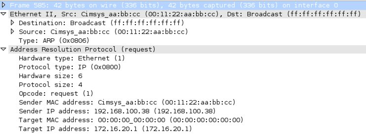

+++
title = "Scapy p.05"
description = "Sending our First Packet; ARP Response"
# date = 2013-10-29
date = 2019-05-11
author = "Mat"
weight = 96
aliases = ["/scapy-p-05-sending-our-first-packet-arp-response/"]
#wp_last_modified_info:
#  - May 3, 2019 @ 8:46 am
[taxonomies]
tags = ["scapy", "python"]
+++

With a good understanding of how to view our packets we can now move onto some packet generation. Let's talk a bit about sniffing first and how existing packets are our best tool for creating new ones.

<!-- more -->
#### Sniff() function arguments


We've used the `sniff()` function a couple times already to capture some packets for viewing. I'm going to explain a little bit more about the `sniff()` function and its arguments. The arguments we will be talking about are:
  * **count:** Number of packets to capture. 0 means infinity.
  * **iface:** Sniff for packets only on the provided interface.
  * **prn:** Function to apply to each packet. If something is returned, it is displayed. For instance you can use prn = lambda x: x.summary().
  * **store:** Whether to store sniffed packets or discard them. When you only want to monitor your network forever, set store to 0.
  * **timeout:** Stop sniffing after a given time (default: None).

These should all be self-explanatory except for the `filter` and `prn` arguments. The `filter` argument takes <a href="http://biot.com/capstats/bpf.html" target="_blank" rel="noopener noreferrer">BPF syntax filters</a>, just like Wireshark or tcpdump capture filters. The `prn` argument is a very cool capability of the `sniff()` function and you can read more about it here: <a href="/scapy-sniffing-with-custom-actions-part-1/" target="_blank" rel="noopener noreferrer">Scapy and custom actions.</a>

Since we want to generate our first ARP packet we should go ahead and sniff one to see what it takes to recreate one using the `.show()` and `.command()` method. Here's a sniff using the `count` and `filter` arguments:

```python
>>> pkts = sniff(count=5, filter="arp")
>>> pkts.summary()
Ether / ARP who has 172.16.20.255 says 172.16.20.40 / Padding
Ether / ARP who has 172.16.20.244 says 172.16.20.40 / Padding
Ether / ARP who has 172.16.20.252 says 172.16.20.40 / Padding
Ether / ARP who has 172.16.20.253 says 172.16.20.40 / Padding
Ether / ARP who has 172.16.20.80 says 172.16.20.74 / Padding
>>> pkts[0].show()
###[ Ethernet ]###
  dst= ff:ff:ff:ff:ff:ff
  src= 00:11:22:aa:bb:cc
  type= 0x806
###[ ARP ]###
     hwtype= 0x1
     ptype= 0x800
     hwlen= 6
     plen= 4
     op= who-has
     hwsrc= 00:11:22:aa:bb:cc
     psrc= 172.16.20.40
     hwdst= 00:00:00:00:00:00
     pdst= 172.16.20.255
###[ Padding ]###
>>> pkts[0].command()
"Ether(src='00:11:22:aa:bb:cc', dst='ff:ff:ff:ff:ff:ff', type=2054)/ARP(hwdst='00:00:00:00:00:00', ptype=2048, hwtype=1, psrc='172.16.20.40', hwlen=6, plen=4, pdst='172.16.20.255', hwsrc='00:11:22:aa:bb:cc', op=2)"
```

#### Building a Packet

It looks like ARP packets only have 2 layers plus padding that we have to worry about. We can use the `ls()` function on the Ether and ARP layers to see what options are available to us:

```python
>>> ls(Ether)
dst        : DestMACField         = (None)
src        : SourceMACField       = (None)
type       : XShortEnumField      = (0)
>>> ls(ARP)
hwtype     : XShortField          = (1)
ptype      : XShortEnumField      = (2048)
hwlen      : ByteField            = (6)
plen       : ByteField            = (4)
op         : ShortEnumField       = (1)
hwsrc      : ARPSourceMACField    = (None)
psrc       : SourceIPField        = (None)
hwdst      : MACField             = ('00:00:00:00:00:00')
pdst       : IPField              = ('0.0.0.0')
```

Let's create our ARP packet and start assigning some values. We construct a new ARP packet, and use the assignment operator customize specific fields of our packet:

```python
>>> arppkt = Ether()/ARP()
>>> arppkt[ARP].hwsrc = "00:11:22:aa:bb:cc"
>>> arppkt[ARP].pdst = "172.16.20.1"
>>> arppkt[Ether].dst = "ff:ff:ff:ff:ff:ff"
>>> arppkt
<Ether  dst=ff:ff:ff:ff:ff:ff type=0x806 |<ARP  hwsrc=00:11:22:aa:bb:cc pdst=172.16.20.1 |>>
```

The layers we want are defined with the with the `Layer()` notation. This will work for any layer in the `ls()` command output. That's a lot of options! You can also define the packet from scratch with all the options in one statement by passing in the fields as arguments to the related layer.

Note that the special glue holding these packets together is the `/` operator. If you happen to forget a layer when you're first defining the packet, you can add on a layer very easily using the existing packet and the `/` operator like this:

```python
>>> tcppkt = Ether()/IP()
>>> tcppkt
<Ether  type=0x800 |<IP  |>>
>>> tcppkt = tcppkt/TCP()
>>> tcppkt
<Ether  type=0x800 |<IP  frag=0 proto=tcp |<TCP  |>>>
```

#### Sending a packet

Yup, you guessed it, its finally time to send this ARP packet out on the wire! Since ARP is a L2 protocol we're going to use the `sendp()` function as the `send()` function only works with L3 Packets (IP or IPv6 headers):

```python
>>> arppkt
<Ether  dst=ff:ff:ff:ff:ff:ff src=00:11:22:aa:bb:cc type=0x806 |<ARP  hwsrc=00:11:22:aa:bb:cc pdst=172.16.20.1 |>>
>>> sendp(arppkt)
.
Sent 1 packets.
```


  
> Screenshot of capture packet in Wireshark

What, what! Check that out! Our packet out from the scapy console and in the wire! Pretty cool, right? Well, here's a fun fact. We don't need to create and build the packet before sending it, we can define the packet right there in the `send()` or `sendp()` function like this:

```python
>>> sendp(Ether(dst="ff:ff:ff:ff:ff:ff",src="00:11:22:aa:bb:cc")/ARP(hwsrc="00:11:22:aa:bb:cc",pdst="172.16.20.1"))
.
Sent 1 packets.
```

In fact, we can do some other cool things with these send functions. If we had an array of packets (such as one created with Python loops and some random or incrementing values for IP address/TCP port), the send function would send each packet in that array:

```python
>>> pkts
<Sniffed: TCP:0 UDP:5 ICMP:4 Other:1>
>>> send(pkts)
..........
Sent 10 packets.
```

The send commands have some arguments to control the packet sending, here's the main ones you might consider using:

**send(pkts, inter=0, loop=0)  
sendp(pkts, inter=0, loop=0)**

  * **iface:** The interface to send the packets out from.
  * **inter:** Time in seconds to wait between 2 packets.
  * **loop:** Send the packets endlessly if not 0.
  * **pkts:** Can be a packet, an implicit packet or a list of them.