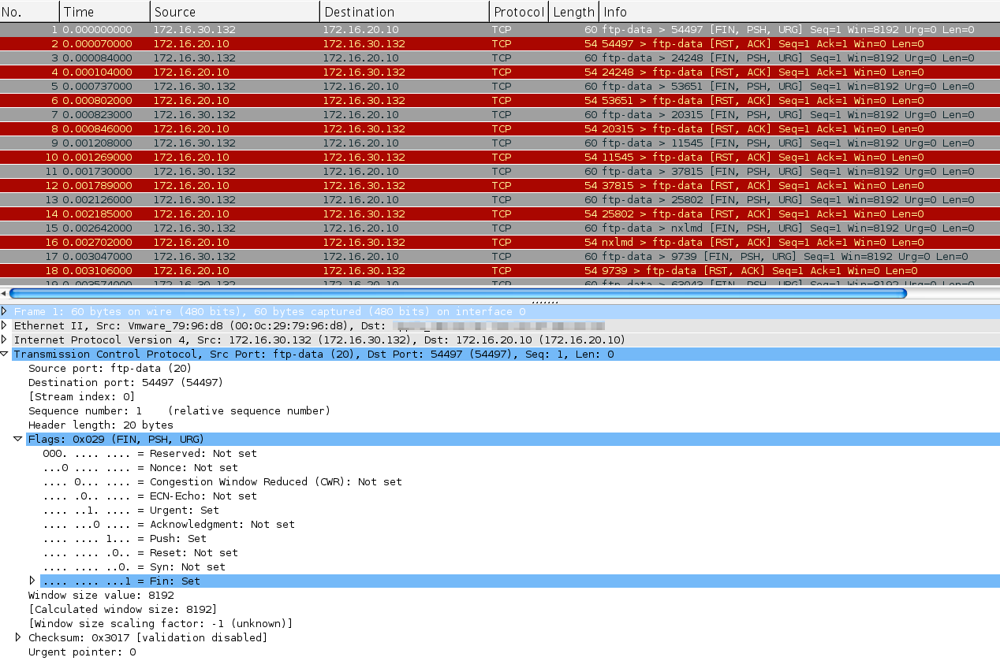

+++
title = "Scapy p.08"
description = "Making a Christmas Tree Packet"
#date = 2013-10-29
date = 2019-05-11
author = "Mat"
weight = 93

aliases = ["/scapy-p-08-making-a-christmas-tree-packet/"]
[taxonomies]
tags = ["scapy", "python"]
+++

We've doing a lot of packet sniffing, analysis, and even some basic packet crafting of our own. With the ICMP packets we created, we only set the destination we wanted to use and let Scapy take care of the rest.
<!-- more -->
#### Taking Control of Protocol Fields

I want to show you how to take a bit more control over the packet creation process by creating a [TCP Christmas Tree packet](http://en.wikipedia.org/wiki/Christmas_tree_packet). I'll let you read the details, just know that the name of this packet comes from every TCP header flag bit turned on (set to 1), so it can be said the packet is "lit up like a Christmas Tree." Here's how we can build this with Scapy:

```python
#! /usr/bin/env python3

from random import randint
from scapy.all import IP, TCP, send

# Create the skeleton of our packet
template = IP(dst="172.16.20.10")/TCP()

# Start lighting up those bits!
template[TCP].flags = 'UFP'

# Create a list with a large number of packets to send
# Each packet will have a random TCP dest port for attack obfuscation
xmas = []
for pktNum in range(0,100):
  xmas.extend(template)
  xmas[pktNum][TCP].dport = randint(1,65535)

# Send the list of packets
send(xmas)
```

Console Output:
```
....................................................................................................
Sent 100 packets.
```

Although we don't get much output from the `send()` function, and no option for the `prn` argument, we can sniff and see what happened:


> Wireshark sniff showing several xmas tree packets and the TCP header with our bits set

Woohoo! Look how awesome we are! Make sure to look through that script so you can see what we're doing. We want to send random TCP ports in our packet, so we have to make an array of packets, each with a different TCP destination port. You could also randomize the source port or any other field using the technique I did in that script.